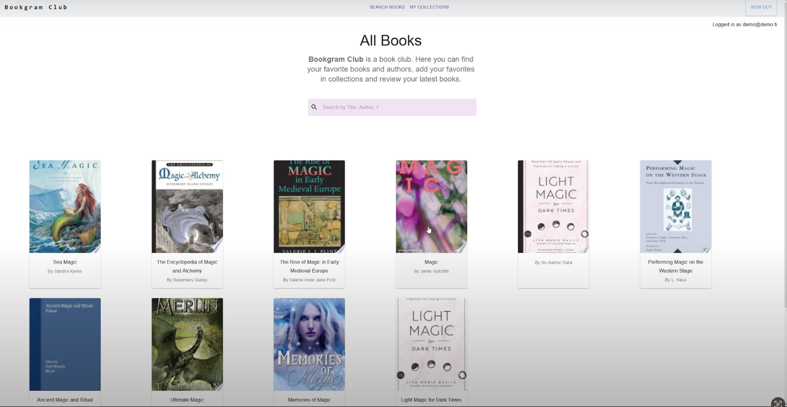
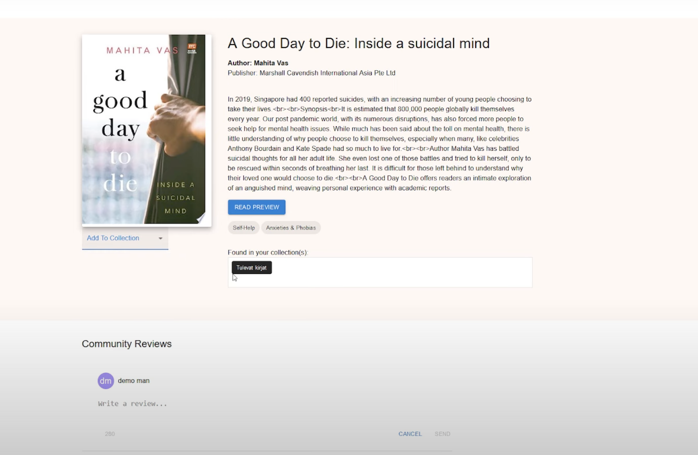
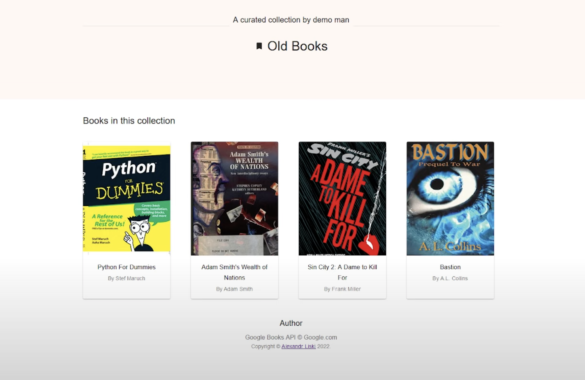
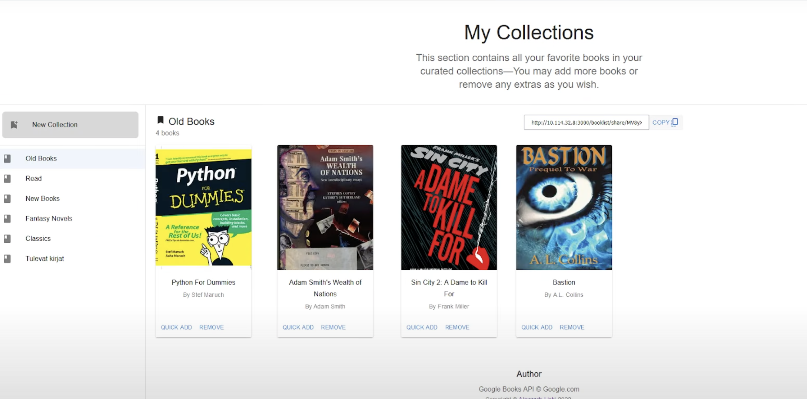

# Bookgram Club 

#### Course project for Web-sovelluskehitys OTP 2

The goal of the project was to create a REST-based microservice with a retrievable API. Book information
is retrieved from Google Books API and other information - such as the book's identification code - is saved in
the service.

With the service, the users can create their own book collections that can be shared, explored and reviewed. Each collection generates a shareable link.

The project uses React-basd MUI user interface library.


## Setup

The backend uses *Express.js* running on *Node 16* and vanilla javascript. **src** folder contains backend and **frontend** was build on React.

Prerequisites:
- [Node](https://nodejs.org/en/) 16.17
- database: [Postgres](https://www.postgresql.org/)
- frontend: [React](https://react.dev) 17.0.2
- backend: [Express](https://expressjs.com) 4.17.1
- [MUI-materials](https://mui.com) 5.10.9


For development, a simple nodemon server is enough.
```bash
# development 
npm nodemon
npm run start
```


## Usage
The file in scripts db.sql must be added to Postgresql database and superuser/credentials must be also created for the schemas and db.

The project requires a database. Postgres is recommended. Create a database called `projo` and run file `./scripts/db.sql` on superuser credentials. You can edit the name of database and other settings in environment (.env) file.

Frontend has it's own settings file. Assign the address to send requests.


### Routing

The API is structured as follows:

/api/'[subroot]'/subroutine

subroot can either be 'users', 'reviews' or 'books'

[API Documentation](https://documenter.getpostman.com/view/23898922/2s847HQtLf)


### Screenshots


<table>
  <tr>
  	<td align="center">
      
    </td>
    <td align="center">
      
    </td>
  </tr>
  <tr>
  	<td align="center">
      
    </td>
    <td align="center">
      
    </td>
  </tr>
</table>
